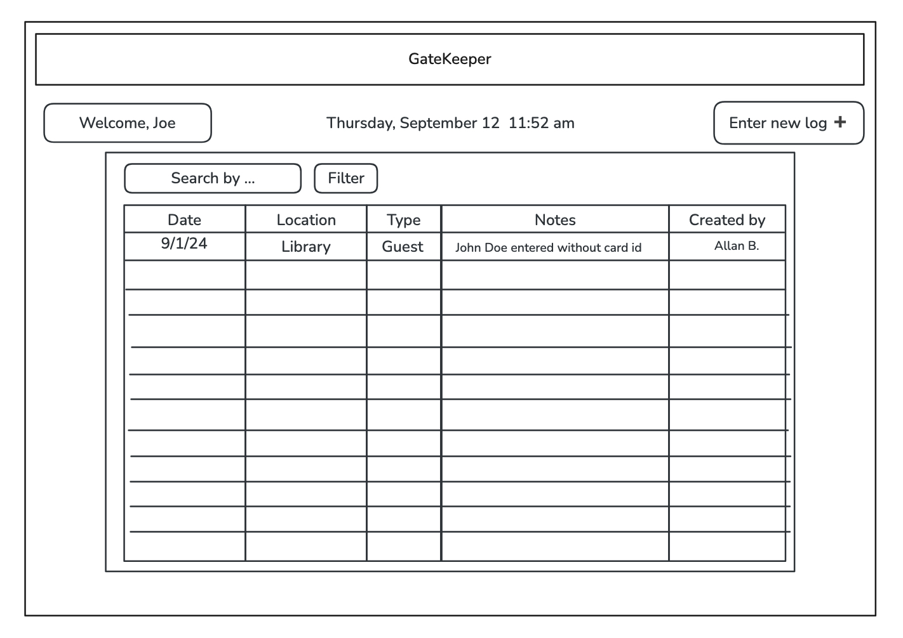

# GateKeeper
[gatekeeper.maxiparis.com](http://gatekeeper.maxiparis.com)
## Specification Deliverable

### Elevator pitch

GateKeeper, the ultimate logbook replacement for security teams! Designed to make logging incidents easier and more
accurate, GateKeeper allows guards to quickly record and track events in real-time. No more messy paperwork or
hard-to-read entries — this app streamlines the process with powerful search and filtering features, so finding
logs by category or keyword is faster than ever. Plus, with live data updates, your entire team stays in sync,
receiving the latest information on the go, ensuring that everyone is always up to date.

### Design

### Key features

- Secure login to account and to logbooks (companies would have different logbooks)
- Tailored for security guards, law and parking enforcement officers, custodians, building and facility managers, and more.
- Ability to enter logs for any kind of need, whether it is for patrols, simple and complex bookkeeping tasks, incident reporting, equipment checks, maintenance requests, or any other operational activity.
- Logs, users, and logbooks are persistently stored.
- Log templates with required and optional fields, lists, and event categories, make the logging process faster and more accurate.
- Advanced filters and search bars eliminate the need to sift through endless pages of physical logbooks.

### Technologies

I am going to use the required technologies in the following ways.

- **HTML** - Uses correct HTML structure for application. Three HTML pages. One for login and one for seeing the logs, one for entering a new log. Hyperlinks to choice artifact.
- **CSS** - Application styling that looks good on different screen sizes, uses good whitespace, color choice and contrast.
- **React** - Provides login, choice display, applying votes, display other logs from other users, and use of React for routing and components.
- **Service** - Backend service with endpoints for:
    - login
    - retrieving logs
    - submitting logs
    - retrieving logbooks
- **DB/Login** - Store users, logbooks, and logs in database. Register and login users. Credentials securely stored in database. Can't see logs unless authenticated.
- **WebSocket** - As each user adds logs, their logs are sent to all other users.

## HTML Deliverable

For this deliverable I built out the structure of my application using HTML.

- [x] **HTML pages** - 5 HTML pages: index, login, signup, logbook, add new logbook. 
- [x] **Links** - Each page contains a navigation menu that links to all the pages. Sign up and Log in link to each other in the case user has already created an account and vice versa.
- [x] **Text** - Each of the logbooks entries is represented in a table. Examples have been included to simulate data.
- [x] **Images** - Included one image that adds style and context to the index page.
- [x] **DB** - Input box and submit button for login and signup, as well as a new log will be saved to the database. Logs will be retrieved from the database as well as users. Other things to be retrieved from database are categories and maybe names of authors (each company would have a set of authorized users).  
- [x] **WebSocket** - The records or rows in the logbook will all be populated directly from the WebSocket connection, allowing users to add, remove or edit logs and allowing everyone else in that company to see those changes without having to reload the page.

## CSS Deliverable

For this deliverable I properly styled the application into its final appearance using the Bootstrap framework.

- [x] **Header, footer, and main content body**
- [x] **Navigation elements** - I dropped the underlines and changed the color for anchor elements.
- [x] **Responsive to window resizing** - My app looks great on all window sizes and devices. I made sure to let the user know that they need to rotate their phone in order to see the table in the Logbook page. 
- [x] **Phone optimization** - I made sure every element of the app looks good on a big screen or in a small one. 
- [x] **Application elements** - Used good contrast and whitespace.
- [x] **Application text content** - Consistent and responsive fonts. 
- [x] **Application images** - Styled my image in the home page and added rounded corners.

## React deliverable
For this deliverable, I used JavaScript and React so that the application completely works for a single user. I also added placeholders for future technology.

- [x] **Bundled and transpiled** - done!
- [x] **Components** -
  - [x] **Home**
    - The card that invites an app visitor to `Create an account` or `Log in` to the account, if a member already, is hidden if the user is authenticated.
  - [x] **Login**
    - Username and password are checked. If they don't match any created account, then the user is informed.
    - `Login` button is disabled if username or password fields are empty.
    - If the user is authenticated, then we display a button to sign out and a button to see the Logbook.
    - When the user is logged in, the `Login` button displays `Account` instead. We also display a message `Welcome, {username}`
  - [x] **Signup**
    - If a user is authenticated, then the `Sign up` button in the navigation bar will be hidden.
    - Robust app:
      - First and last name fields only accept letters.
      - We check if the username has been taken. Otherwise, we let the user know.
      - Sign up button is disabled unless all fields are filled.
      - When the user is signed up, we authenticate them and take them to the login page, where they will be welcomed and given the option to log out or go to the `Logbook`.
  - [x] **Logbook**
    - Entries display
      - Logbook entries are displayed in a table.
      - Each row in the table can be removed.
      - Hover over the rows for improved user experience.
      - Total entries in the table are displayed. If the entries are filtered, we display how many are filtered as well.
    - Add new log
      - Can't save the log unless all fields have been filled.
      - Persistently saves the log to the entries.
    - Filter log entries
      - As soon as any field is filled, the table is filtered.
      - `Clear filter` button removes all filters.
    - Test buttons
      - I have included 3 buttons to help testing the app:
        - Test entries
          - This button imports 12 entries to help save time when testing different aspects of the app.
        - Clear entries
          - Removes all the entries.
        - Test websocket
          - This button starts or pauses the "websocket" testing. When the testing is in progress, the app will be notified every 5 seconds of a new entry added by another person.
          - The user will see a notification in the top right corner when a new entry has been created.
          - When a new entry has been added (as of now, by the `logBookNotifier`), the Logbook will re-render its table automatically.
          - Stop the websocket testing by clicking the button again.
  - [x] **database** - Accounts and logbook entries. Currently, this is stored and retrieved from local storage, but it will be replaced with the database data later.
  - [x] **WebSocket** - I used the setInterval function to periodically add a new logbook entry and notify the user. This will be replaced with WebSocket messages later.
  - [x] **application logic** - The highlight and ranking number change based on the user's selections.
- [x] **Router** - Routing in the main page to all sub-pages, including `Login`, `Signup`, `Logbook`, and `Home`.
- [x] **Hooks** - I use React hooks throughout my application, especially in the `Logbook` page.
- [x] **API call** - The logbook displays the local time and weather. The app will display the weather from a 3rd party api call. I created a placeholder function to simulate this.

### Testing steps for React phase.
1. Log in with the test user (username: `a`, password: `a`) or create a new account. Try to create an account with the username `a`.
2. Now you are authenticated, the Login button in the navbar becomes `Account`, and the `Signup` button is hidden. Now you can also see the `Logbook` button in the navbar.
3. Go to Logbook
4. Add a new log or click `Test entries`.
5. Play around with the filters to make sure they filter as they should.
6. Test the websocket by clicking `Test Websocket`. This action will trigger the `logbookNotifier` to start creating entries directly into the localStorage and notifying the Logbook of those additions.
7. You should see the notifications of a new entry by another user in the top right corner, and the entries should be automatically re-loaded to display the new entry.

## Service deliverable

- [x] **Node.js/Express HTTP service** - done!
- [x] **Static middleware for frontend** - done!
- [x] **Calls to third party endpoints** - done! calling OpenWeather api, to get current weather for Provo.
  - My frontend calls my backend, which calls the OpenWeather API route. 
    - Why did I design it this way?
    - The OpenWeather API requested me to pass my OpenWeather API key as a query string in the url, which I didn't think it was a good idea to do from the frontend, because anyone would be able to copy and use my key.
    - Because of that I decided to have my backend load the api key through the `dotenv`, contact the OpenWeather API and then send that response back to the frontend.
- [x] **Backend service endpoints** - Done! Implemented endpoints for login, signup, logout, get entries, create entries and delete entries.
  - Security Features:
    - The endpoints for get, create and delete logbook entries need to be called using a bearer token via headers. 
    - This token is received by a user when they log in or signup. The frontend stores it via localStorage.
    - This process allows the logbook entries to be read or modified only by an authenticated user.
- [x] **Frontend calls service endpoints** - done using axios. 
- [x] **Websocket simulation** - I modified `LogbookNotifier` (websocket manager) to create entries in the backend, and then notifying the frontend about the new entry. The frontend then proceeds to notify the user via a notification and reloads the entries from the backend.